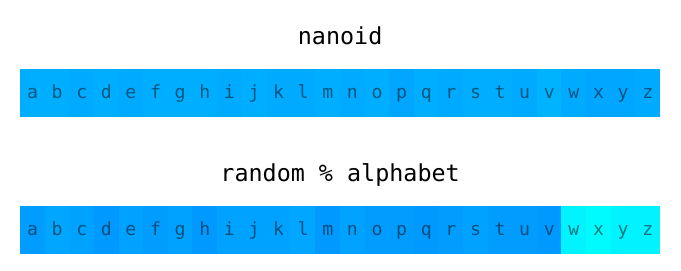

# Nano ID


<div dir="rtl">

[English](./README.md) | [日本語](./README.ja.md) | [Русский](./README.ru.md) | [简体中文](./README.zh-CN.md) | [Bahasa Indonesia](./README.id-ID.md) | [한국어](./README.ko.md) | **العربية**

مُولِّد مُعرِّفات فريدة صغير الحجم وآمن ومتوافق مع الروابط (URL) لجافاسكربت.

> "مستوى مذهل من الكمالية التي لا معنى لها،
> والتي يستحيل ألّا تحظى بالاحترام."

* **صغير الحجم.** 118 بايت فقط (بعد التصغير والضغط ببروتلي). بدون أيّ اعتماديات خارجية.
  يتم التحكّم بالحجم عبر [Size Limit].
* **آمن.** يستخدم مُولِّد أرقام عشوائية على مستوى العتاد. يمكن استخدامه في بيئات الكلستر.
* **مُعرِّفات قصيرة.** يستخدم أبجدية أكبر من UUID وهي (`A-Za-z0-9_-`).
  لذا تم تقليص حجم المُعرِّف من 36 إلى 21 رمزًا.
* **قابل للنقل.** تم نقل Nano ID
  إلى أكثر من [20 لغة برمجة](./README.md#other-programming-languages).

</div>

```js
import { nanoid } from 'nanoid'
model.id = nanoid() //=> "V1StGXR8_Z5jdHi6B-myT"
```

---

  Made at <b><a href="https://evilmartians.com/devtools?utm_source=nanoid&utm_campaign=devtools-button&utm_medium=github">Evil Martians</a></b>, product consulting for <b>developer tools</b>.

---

[online tool]: https://gitpod.io/#https://github.com/ai/nanoid/
[with Babel]:  https://developer.epages.com/blog/coding/how-to-transpile-node-modules-with-babel-and-webpack-in-a-monorepo/
[Size Limit]:  https://github.com/ai/size-limit


<div dir="rtl">

## جدول المحتويات

- [جدول المحتويات](#جدول-المحتويات)
- [المقارنة مع UUID](#المقارنة-مع-uuid)
- [اختبار الأداء](#اختبار-الأداء)
- [الأمان](#الأمان)
- [التثبيت](#التثبيت)
  - [ESM](#esm)
  - [CommonJS](#commonjs)
  - [JSR](#jsr)
  - [CDN](#cdn)
- [واجهة البرمجة (API)](#واجهة-البرمجة-api)
  - [متزامن (Blocking)](#متزامن-blocking)
  - [غير آمن (Non-Secure)](#غير-آمن-non-secure)
  - [أبجدية أو حجم مخصّص](#أبجدية-أو-حجم-مخصّص)
  - [مُولِّد بايتات عشوائية مخصّص](#مُولِّد-بايتات-عشوائية-مخصّص)
- [الاستخدام](#الاستخدام)
  - [React](#react)
  - [React Native](#react-native)
  - [PouchDB و CouchDB](#pouchdb-و-couchdb)
  - [سطر الأوامر (CLI)](#سطر-الأوامر-cli)
  - [TypeScript](#typescript)
  - [لغات البرمجة الأخرى](#لغات-البرمجة-الأخرى)
- [الأدوات](#الأدوات)


## المقارنة مع UUID

Nano ID قابل للمقارنة مع UUID v4 (المبني على العشوائية).
يحتوي على عدد مماثل من البتّات العشوائية في المُعرِّف
(126 في Nano ID و122 في UUID)، لذا فإنّ احتمالية التكرار متقاربة:

> لكي تكون هناك فرصة واحدة من مليار لحدوث تكرار،
> يجب توليد 103 تريليون مُعرِّف من النوع v4.

يوجد اختلافان رئيسيان بين Nano ID و UUID v4:

1. يستخدم Nano ID أبجدية أكبر، لذا يتم ضغط عدد مماثل من البتّات العشوائية
   في 21 رمزًا فقط بدلاً من 36.
2. كود Nano ID أصغر بـ **4 مرات** من حزمة `uuid/v4`:
   118 بايت مقابل 423.


## اختبار الأداء

</div>

```rust
$ node ./test/benchmark.js
crypto.randomUUID          7,619,041 ops/sec
uuid v4                    7,436,626 ops/sec
@napi-rs/uuid              4,730,614 ops/sec
uid/secure                 4,729,185 ops/sec
@lukeed/uuid               4,015,673 ops/sec
nanoid                     3,693,964 ops/sec
customAlphabet             2,799,255 ops/sec
nanoid for browser           380,915 ops/sec
secure-random-string         362,316 ops/sec
uid-safe.sync                354,234 ops/sec
shortid                       38,808 ops/sec

Non-secure:
uid                       11,872,105 ops/sec
nanoid/non-secure          2,226,483 ops/sec
rndm                       2,308,044 ops/sec
```

<div dir="rtl">

بيئة الاختبار: Framework 13 7840U، فيدورا 39، Node.js 21.6.


## الأمان

*اقرأ مقالاً جيداً عن نظرية مُولِّدات الأرقام العشوائية:
[Secure random values (in Node.js)]*

* **عدم القابلية للتنبؤ.** بدلاً من استخدام `Math.random()` غير الآمن، يستخدم Nano ID
  وحدة `crypto` في Node.js و Web Crypto API في المتصفحات.
  هذه الوحدات تستخدم مُولِّد أرقام عشوائية على مستوى العتاد لا يمكن التنبؤ به.
* **التوزيع المنتظم.** `random % alphabet` هو خطأ شائع عند برمجة مُولِّد مُعرِّفات.
  التوزيع لن يكون متساويًا؛ بعض الرموز ستظهر بتواتر أقل من غيرها.
  وهذا يقلّل عدد المحاولات اللازمة للكسر بالقوة الغاشمة. يستخدم Nano ID
  [خوارزمية أفضل] وقد تم اختباره للتحقّق من انتظام التوزيع.

  

* **موثّق جيداً:** جميع الحيل البرمجية في Nano ID موثّقة. اطّلع على التعليقات
  في [الكود المصدري].
* **الثغرات الأمنية:** للإبلاغ عن ثغرة أمنية، يُرجى استخدام
  [جهة اتصال Tidelift الأمنية](https://tidelift.com/security).
  سيقوم Tidelift بتنسيق الإصلاح والإفصاح.

[Secure random values (in Node.js)]: https://gist.github.com/joepie91/7105003c3b26e65efcea63f3db82dfba
[خوارزمية أفضل]:                  https://github.com/ai/nanoid/blob/main/index.js
[الكود المصدري]:                        https://github.com/ai/nanoid/blob/main/index.js


## التثبيت

### ESM

يعمل Nano ID 5 مع مشاريع ESM (باستخدام `import`) في الاختبارات أو سكربتات Node.js.

</div>

```bash
npm install nanoid
```

<div dir="rtl">

### CommonJS

يمكن استخدام Nano ID مع CommonJS بإحدى الطرق التالية:

- يمكنك استخدام `require()` لاستيراد Nano ID. تحتاج إلى استخدام أحدث إصدار من
  Node.js 22.12 (يعمل مباشرة) أو Node.js 20
  (مع علامة `--experimental-require-module`).

- لـ Node.js 18 يمكنك استيراد Nano ID ديناميكيًا كالتالي:

</div>

  ```js
  let nanoid
  module.exports.createID = async () => {
    if (!nanoid) ({ nanoid } = await import('nanoid'))
    return nanoid() // => "V1StGXR8_Z5jdHi6B-myT"
  }
  ```

<div dir="rtl">

- يمكنك استخدام Nano ID 3.x (ما زلنا ندعمه):

</div>

  ```bash
  npm install nanoid@3
  ```

<div dir="rtl">

### JSR

[JSR](https://jsr.io) هو بديل لـ npm بحوكمة مفتوحة
وتطوير نشط (على عكس npm).

</div>

```bash
npx jsr add @sitnik/nanoid
```

<div dir="rtl">

يمكنك استخدامه في Node.js و Deno و Bun وغيرها.

</div>

```js
// استبدل `nanoid` بـ `@sitnik/nanoid` في جميع الاستيرادات
import { nanoid } from '@sitnik/nanoid'
```

<div dir="rtl">

لـ Deno ثبّته عبر `deno add jsr:@sitnik/nanoid` أو استورده
من `jsr:@sitnik/nanoid`.


### CDN

للتجارب السريعة، يمكنك تحميل Nano ID من CDN. لكن لا يُنصح باستخدامه
في الإنتاج بسبب انخفاض أداء التحميل.

</div>

```js
import { nanoid } from 'https://cdn.jsdelivr.net/npm/nanoid/nanoid.js'
```

<div dir="rtl">

## واجهة البرمجة (API)

يمتلك Nano ID واجهتي برمجة: عادية وغير آمنة.

بشكل افتراضي، يستخدم Nano ID رموزًا متوافقة مع الروابط (`A-Za-z0-9_-`) ويُنتج مُعرِّفًا
مكوّنًا من 21 حرفًا (ليكون احتمال التكرار مماثلاً لـ UUID v4).


### متزامن (Blocking)

الطريقة الأسهل والأكثر أمانًا لاستخدام Nano ID.

في حالات نادرة قد يحجب المعالج عن العمليات الأخرى أثناء جمع الضوضاء
لمُولِّد الأرقام العشوائية على مستوى العتاد.

</div>

```js
import { nanoid } from 'nanoid'
model.id = nanoid() //=> "V1StGXR8_Z5jdHi6B-myT"
```

<div dir="rtl">

إذا أردت تقليل حجم المُعرِّف (وزيادة احتمالية التكرار)،
يمكنك تمرير الحجم كمعامل.

</div>

```js
nanoid(10) //=> "IRFa-VaY2b"
```

<div dir="rtl">

لا تنسَ التحقّق من أمان حجم المُعرِّف الخاص بك
عبر حاسبة [احتمالية تكرار المُعرِّف].

يمكنك أيضًا استخدام [أبجدية مخصّصة](#أبجدية-أو-حجم-مخصّص)
أو [مُولِّد أرقام عشوائية مخصّص](#مُولِّد-بايتات-عشوائية-مخصّص).

[احتمالية تكرار المُعرِّف]: https://zelark.github.io/nano-id-cc/


### غير آمن (Non-Secure)

بشكل افتراضي، يستخدم Nano ID توليد بايتات عشوائية على مستوى العتاد
من أجل الأمان وتقليل احتمالية التكرار. إذا لم يكن الأمان مهمًا بالنسبة لك،
يمكنك استخدامه في بيئات لا تتوفر فيها مُولِّدات أرقام عشوائية على مستوى العتاد.

</div>

```js
import { nanoid } from 'nanoid/non-secure'
const id = nanoid() //=> "Uakgb_J5m9g-0JDMbcJqLJ"
```

<div dir="rtl">

### أبجدية أو حجم مخصّص

تُرجع `customAlphabet` دالة تتيح لك إنشاء `nanoid`
بأبجديتك وحجمك الخاصّين.

</div>

```js
import { customAlphabet } from 'nanoid'
const nanoid = customAlphabet('1234567890abcdef', 10)
model.id = nanoid() //=> "4f90d13a42"
```

```js
import { customAlphabet } from 'nanoid/non-secure'
const nanoid = customAlphabet('1234567890abcdef', 10)
user.id = nanoid()
```

<div dir="rtl">

تحقّق من أمان أبجديتك المخصّصة وحجم المُعرِّف عبر
حاسبة [احتمالية تكرار المُعرِّف]. لمزيد من خيارات الأبجديات، اطّلع على
[`nanoid-dictionary`].

يجب أن تحتوي الأبجدية على 256 رمزًا أو أقل.
وإلا فإن أمان خوارزمية المُولِّد الداخلية غير مضمون.

بالإضافة إلى تحديد حجم افتراضي، يمكنك تغيير حجم المُعرِّف عند استدعاء
الدالة:

</div>

```js
import { customAlphabet } from 'nanoid'
const nanoid = customAlphabet('1234567890abcdef', 10)
model.id = nanoid(5) //=> "f01a2"
```

[احتمالية تكرار المُعرِّف]: https://zelark.github.io/nano-id-cc/
[`nanoid-dictionary`]:      https://github.com/CyberAP/nanoid-dictionary

<div dir="rtl">

### مُولِّد بايتات عشوائية مخصّص

تتيح لك `customRandom` إنشاء `nanoid` واستبدال الأبجدية
ومُولِّد البايتات العشوائية الافتراضي.

في هذا المثال، يتم استخدام مُولِّد مبني على بذرة (seed):

</div>

```js
import { customRandom } from 'nanoid'

const rng = seedrandom(seed)
const nanoid = customRandom('abcdef', 10, size => {
  return (new Uint8Array(size)).map(() => 256 * rng())
})

nanoid() //=> "fbaefaadeb"
```

<div dir="rtl">

يجب أن تقبل دالة `random` حجم المصفوفة وتُرجع مصفوفة
من الأرقام العشوائية.

إذا أردت استخدام نفس الرموز المتوافقة مع الروابط مع `customRandom`،
يمكنك الحصول على الأبجدية الافتراضية عبر `urlAlphabet`.

</div>

```js
const { customRandom, urlAlphabet } = require('nanoid')
const nanoid = customRandom(urlAlphabet, 10, random)
```

<div dir="rtl">

ملاحظة: بين إصدارات Nano ID قد يتغيّر تسلسل استدعاء مُولِّد الأرقام العشوائية.
إذا كنت تستخدم مُولِّدات مبنية على بذرة، فإننا لا نضمن نفس النتيجة.


## الاستخدام

### React

لا توجد طريقة صحيحة لاستخدام Nano ID كخاصية `key` في React
لأنها يجب أن تكون ثابتة بين عمليات التصيير (renders).

</div>

```jsx
function Todos({todos}) {
  return (
    <ul>
      {todos.map(todo => (
        <li key={nanoid()}> /* لا تفعل هذا */
          {todo.text}
        </li>
      ))}
    </ul>
  )
}
```

<div dir="rtl">

يجب عليك بدلاً من ذلك استخدام مُعرِّف ثابت من داخل عنصر القائمة.

</div>

```jsx
const todoItems = todos.map((todo) =>
  <li key={todo.id}>
    {todo.text}
  </li>
)
```

<div dir="rtl">

في حال لم تمتلك مُعرِّفات ثابتة، يُفضّل استخدام الفهرس (index)
كـ `key` بدلاً من `nanoid()`:

</div>

```jsx
const todoItems = todos.map((text, index) =>
  <li key={index}> /* غير مُوصى به لكنه أفضل من nanoid().
                      استخدمه فقط إذا لم تكن لديك مُعرِّفات ثابتة. */
    {text}
  </li>
)
```

<div dir="rtl">

إذا كنت تحتاج فقط إلى مُعرِّفات عشوائية لربط العناصر ببعضها مثل
labels وحقول الإدخال، يُنصح باستخدام [`useId`].
تمت إضافة هذا الـ hook في React 18.

[`useId`]: https://react.dev/reference/react/useId


### React Native

لا يحتوي React Native على مُولِّد أرقام عشوائية مدمج. يعمل البوليفِل التالي
مع React Native العادي و Expo بدءًا من الإصدار `39.x`.

1. اطّلع على توثيق [`react-native-get-random-values`] وثبّتها.
2. استوردها قبل Nano ID.

</div>

```js
import 'react-native-get-random-values'
import { nanoid } from 'nanoid'
```

[`react-native-get-random-values`]: https://github.com/LinusU/react-native-get-random-values

<div dir="rtl">

### PouchDB و CouchDB

في PouchDB و CouchDB، لا يمكن أن تبدأ المُعرِّفات بشرطة سفلية `_`.
يلزم إضافة بادئة لتجنّب هذه المشكلة، لأن Nano ID قد يستخدم `_`
في بداية المُعرِّف بشكل افتراضي.

أَعِد تعريف المُعرِّف الافتراضي بالخيار التالي:

</div>

```js
db.put({
  _id: 'id' + nanoid(),
  …
})
```

<div dir="rtl">

### سطر الأوامر (CLI)

يمكنك الحصول على مُعرِّف فريد في الطرفية عبر تشغيل `npx nanoid`. تحتاج فقط
إلى Node.js مثبّتًا على النظام. لا يلزم تثبيت Nano ID مسبقًا.

</div>

```sh
$ npx nanoid
npx: installed 1 in 0.63s
LZfXLFzPPR4NNrgjlWDxn
```

<div dir="rtl">

يمكن تحديد حجم المُعرِّف المُولَّد عبر خيار `--size` (أو `-s`):

</div>

```sh
$ npx nanoid --size 10
L3til0JS4z
```

<div dir="rtl">

يمكن تحديد أبجدية مخصّصة عبر خيار `--alphabet` (أو `-a`)
(لاحظ أن `--size` مطلوب في هذه الحالة):

</div>

```sh
$ npx nanoid --alphabet abc --size 15
bccbcabaabaccab
```

<div dir="rtl">

### TypeScript

يتيح Nano ID تحويل النصوص المُولَّدة إلى أنواع مبهمة (opaque types) في TypeScript.
مثال:

</div>

```ts
declare const userIdBrand: unique symbol
type UserId = string & { [userIdBrand]: true }

// استخدم معامل النوع الصريح:
mockUser(nanoid<UserId>())

interface User {
  id: UserId
  name: string
}

const user: User = {
  // يتم التحويل تلقائيًا إلى UserId:
  id: nanoid(),
  name: 'Alice'
}
```

<div dir="rtl">

### لغات البرمجة الأخرى

تم نقل Nano ID إلى العديد من اللغات. يمكنك استخدام هذه الإصدارات للحصول
على نفس مُولِّد المُعرِّفات على جانبَي العميل والخادم.

</div>

* [C](https://github.com/lukateras/nanoid.h)
* [C#](https://github.com/codeyu/nanoid-net)
* [C++](https://github.com/mcmikecreations/nanoid_cpp)
* [Clojure and ClojureScript](https://github.com/zelark/nano-id)
* [ColdFusion/CFML](https://github.com/JamoCA/cfml-nanoid)
* [Crystal](https://github.com/mamantoha/nanoid.cr)
* [Dart & Flutter](https://github.com/pd4d10/nanoid-dart)
* [Elixir](https://github.com/railsmechanic/nanoid)
* [Gleam](https://github.com/0xca551e/glanoid)
* [Go](https://github.com/matoous/go-nanoid)
* [Haskell](https://github.com/MichelBoucey/NanoID)
* [Haxe](https://github.com/flashultra/uuid)
* [Janet](https://sr.ht/~statianzo/janet-nanoid/)
* [Java](https://github.com/wosherco/jnanoid-enhanced)
* [Kotlin](https://github.com/viascom/nanoid-kotlin)
* [MySQL/MariaDB](https://github.com/viascom/nanoid-mysql-mariadb)
* [Nim](https://github.com/icyphox/nanoid.nim)
* [OCaml](https://github.com/routineco/ocaml-nanoid)
* [Perl](https://github.com/tkzwtks/Nanoid-perl)
* [PHP](https://github.com/hidehalo/nanoid-php)
* Python [native](https://github.com/puyuan/py-nanoid) implementation
  with [dictionaries](https://pypi.org/project/nanoid-dictionary)
  and [fast](https://github.com/oliverlambson/fastnanoid) implementation (written in Rust)
* Postgres [Extension](https://github.com/spa5k/uids-postgres)
  and [Native Function](https://github.com/viascom/nanoid-postgres)
* [R](https://github.com/hrbrmstr/nanoid) (with dictionaries)
* [Ruby](https://github.com/radeno/nanoid.rb)
* [Rust](https://github.com/nikolay-govorov/nanoid)
* [Swift](https://github.com/ShivaHuang/swift-nanoid)
* [Unison](https://share.unison-lang.org/latest/namespaces/hojberg/nanoid)
* [V](https://github.com/invipal/nanoid)
* [Zig](https://github.com/SasLuca/zig-nanoid)

<div dir="rtl">

للبيئات الأخرى، يتوفر [سطر الأوامر] لتوليد المُعرِّفات من الطرفية.

[سطر الأوامر]: #سطر-الأوامر-cli


## الأدوات

* [حاسبة حجم المُعرِّف] تعرض احتمالية التكرار عند تعديل
  أبجدية المُعرِّف أو حجمه.
* [`nanoid-dictionary`] تحتوي على أبجديات شائعة لاستخدامها مع [`customAlphabet`].
* [`nanoid-good`] للتأكد من أن المُعرِّف لا يحتوي على كلمات غير لائقة.

[`nanoid-dictionary`]: https://github.com/CyberAP/nanoid-dictionary
[حاسبة حجم المُعرِّف]:  https://zelark.github.io/nano-id-cc/
[`customAlphabet`]:    #أبجدية-أو-حجم-مخصّص
[`nanoid-good`]:       https://github.com/y-gagar1n/nanoid-good

</div>
