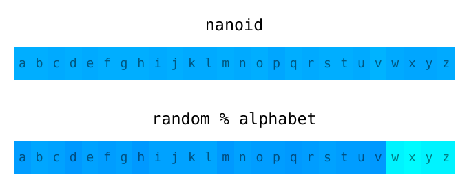

# Nano ID

A tiny, secure URL-friendly unique string ID generator for JavaScript.

```js
var nanoid = require('nanoid')
model.id = nanoid() //=> "Uakgb_J5m9g~0JDMbcJqLJ"
```

**Safe.** It uses cryptographically strong random APIs
and guarantees a proper distribution of symbols.

**Small.** Only 179 bytes (minified and gzipped). No dependencies.
It uses [Size Limit] to control size.

**Compact.** It uses more symbols than UUID (`A-Za-z0-9_~`)
and has the same number of unique options in just 22 symbols instead of 36.

The generator supports Node.js and [all browsers] starting from IE 11.

[all browsers]: http://caniuse.com/#feat=getrandomvalues
[Size Limit]:   https://github.com/ai/size-limit

<a href="https://evilmartians.com/?utm_source=nanoid">
  
</a>

## Security

*See a good article about random generators theory:
[Secure random values (in Node.js)]*

### Unpredictability

Instead of unsafe `Math.random()` Nano ID uses `crypto` module in Node.js
and Web Crypto API in browsers.

### Uniformity

`random % alphabet` is a popular mistake to make when coding an ID generator.
The spread will not be even; there will be a lower chance for some symbols
to appear compared to others—so it will reduce the number of tries
when brute-forcing.

Nano ID uses a [better algorithm] and tests uniformity:



[Secure random values (in Node.js)]: https://gist.github.com/joepie91/7105003c3b26e65efcea63f3db82dfba
[better algorithm]: https://github.com/ai/nanoid/blob/master/format.js

## Comparison with UUID

Nano ID is similar to UUID v4 (random-based). It uses the same number
of random bits in ID, so it has the same collision probability:

> For there to be a one in a billion chance of duplication,
> 103 trillion version 4 IDs must be generated.

There are only 2 differences between Nano ID and UUID v4:

1. Nano ID uses a bigger alphabet for ID, so the same random bits
   are packed in just 22 symbols instead of 36.
2. Nano ID code is 2 times smaller in size than `uuid/v4` package:
   179 bytes instead of 435.

## Benchmark

```
$ ./benchmark
nanoid          375,840 ops/sec
nanoid/generate 268,747 ops/sec
uuid/v4         374,767 ops/sec
shortid          41,260 ops/sec
```


## Usage

### Normal

The main module uses URL-friendly symbols (`A-Za-z0-9_~`) and returns an ID
with 22 characters (to have the same collisions probability as UUID v4).

```js
var nanoid = require('nanoid')
model.id = nanoid() //=> "Uakgb_J5m9g~0JDMbcJqLJ"
```

Symbols `-,.()` are not encoded in URL, but in the end of a link
they could be identified as a punctuation symbol.

If you want to reduce ID length (and increase collisions probability),
you can pass length as argument:

```js
nanoid(10) //=> "IRFa~VaY2b"
```

### Custom Alphabet or Length

If you want to change the ID alphabet or the length
you can use low-level `generate` module.

```js
var generate = require('nanoid/generate')
model.id = generate('1234567890abcdef', 10) //=> "4f90d13a42"
```

Alphabet must contain less than 256 symbols.

### Custom Random Bytes Generator

You can replace the default safe random generator using the `format` module.
For instance, to use seed-based generator.

```js
var format = require('nanoid/format')

function random (size) {
  var result = []
  for (var i = 0; i < size; i++) result.push(randomByte())
  return result
}

format(random, "abcdef", 10) //=> "fbaefaadeb"
```

`random` callback must accept the array size and return an array
with random numbers.

If you want to use the same URL-friendly symbols with `format`,
you can get default alphabet from the `url` module:

```js
var url = require('nanoid/url')
format(random, url, 10) //=> "93ce_Ltuub"
```

## Other Programming Languages

* [Go](https://github.com/matoous/go-nanoid)
* [PHP](https://github.com/hidehalo/nanoid-php)
* [Python](https://github.com/puyuan/py-nanoid)
* [Ruby](https://github.com/radeno/nanoid.rb)
